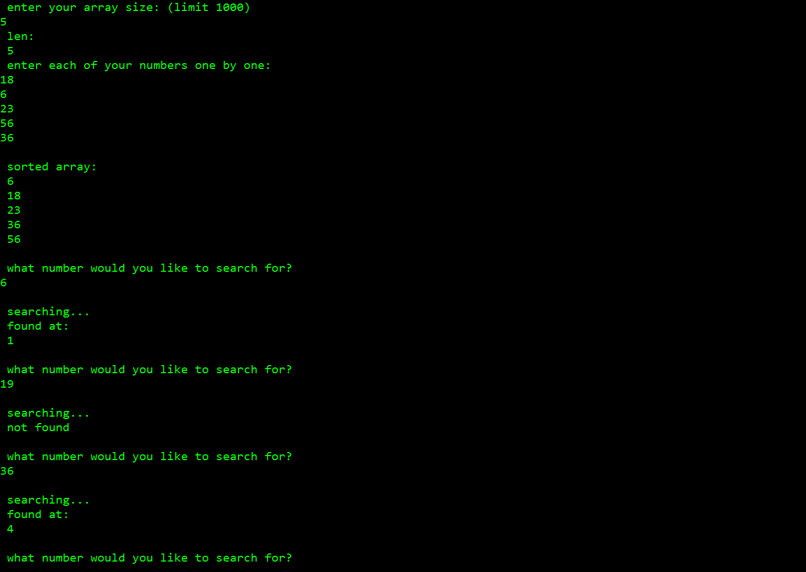

# Fortran 77 Bubble Sort + Binary Search

### Author: Mingtau Li

## About this program
This program asks a user to enter numbers into an array and then searches for a number in the array.

Sorting Algorithm used: bubble sort

Searching Algorithm: binary search

## Screenshot

